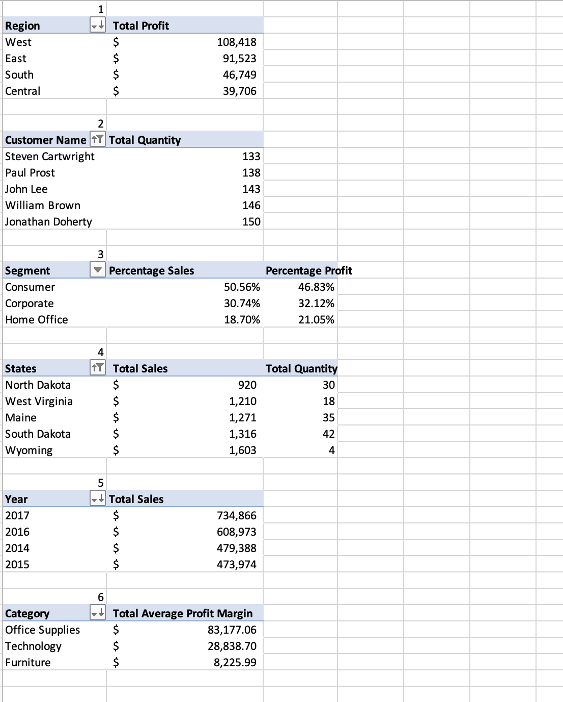
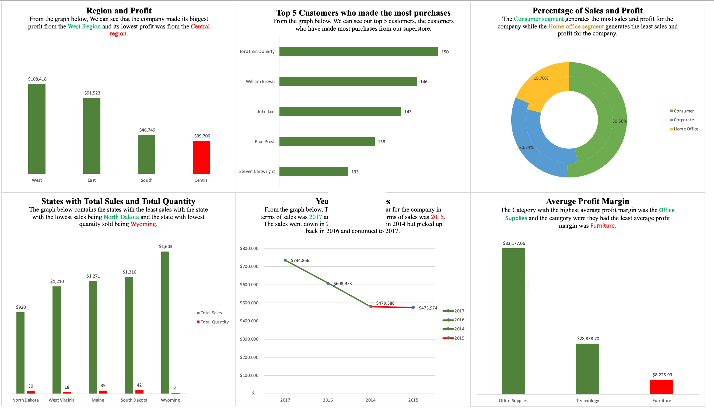

# Analysis-of-a-Superstore-Sales-Data-Using-Excel

## Introduction
The dataset contains information about the sales of a fictional retail company called "Superstore" over four(4) years, from 2014 to 2017. This includes a comprehensive dataset and accompanying analysis of sales data in the United States. The dataset includes valuable information about various orders, products, customers and sales performance. The dataset covers a wide range of product categories, customer segments and geographical locations making it an ideal resource for conducting diverse analyses. I used Excel for Data Analysis and Visualization.

## Problem Statement
The company is trying to find solutions to some fundamental problems and I was tasked with finding solutions to the questions and problems. The problems can be seen below:
1. What was the total profit generated for each region (East, West, South, Central) and determine the region with the highest overall profit.
2. Identify the top 5 customers who made the most purchases by the total number of items bought.
3. Find out the percentage of total revenue and profit for each customer segment (Consumer, Corporate, Home Office).
4. Which states had the lowest number of sales transactions and revenue?
5. Analyze the sales trend over the years (2014 to 2017) and identify the year with the highest revenue.
6. Which product category (Furniture, Office Supplies, or Technology) has the highest average profit margin?

## Skills Demonstrated
1. Data  Processing
2. Data Analysis
3. Use of the Sum() function
4. Use of the Average() function
5. Use of the Year() function
6. Use of Pivot Table
7. Data Visualization

## Data Analysis
The original data table provided was a complete data table. The original complete data table can be seen under the file section. The file is called **Superstore.csv**. 
The business problem was solved using the Pivot table in Excel. The Pivot table can be seen below

The next step I did was to visualize my data solved using the Pivot table seen above. In the visuals below better explanations are made to better explain and provide solutions to the company's problems.

