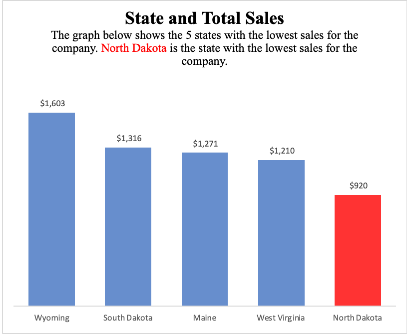
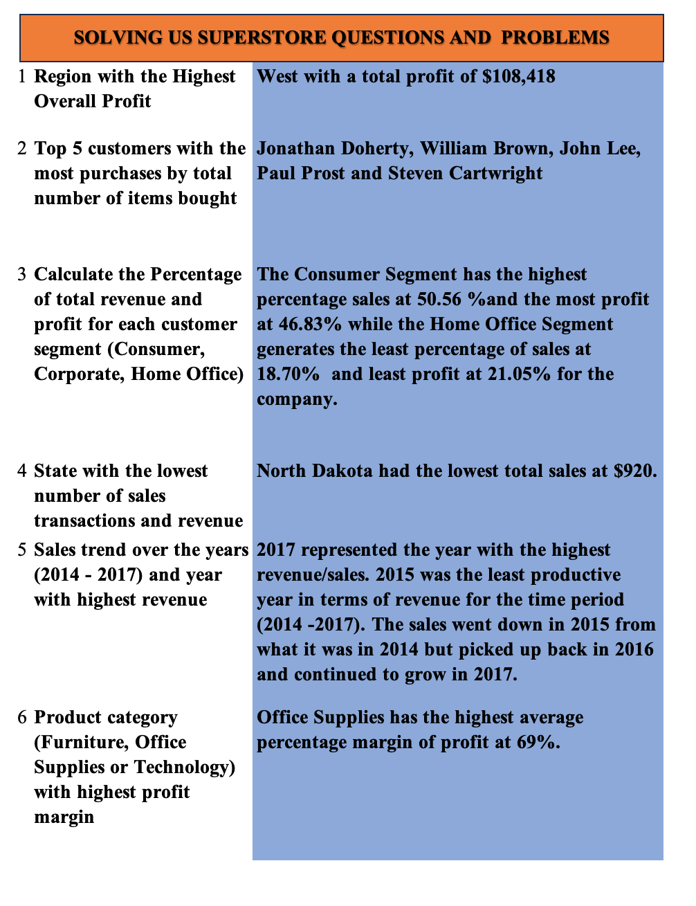

# Analysis-of-a-Superstore-Sales-Data-Using-Excel

## Introduction
The dataset contains information about the sales of a fictional retail company called "Superstore" over four(4) years, from 2014 to 2017. This includes a comprehensive dataset and accompanying analysis of sales data in the United States. The dataset includes valuable information about various orders, products, customers and sales performance. The dataset covers a wide range of product categories, customer segments and geographical locations making it an ideal resource for conducting diverse analyses. I used Excel for Data Analysis and Visualization.

## Problem Statement
The company is trying to find solutions to some fundamental problems and I was tasked with finding solutions to the questions and problems. The problems can be seen below:
1. What was the total profit generated for each region (East, West, South, Central) and determine the region with the highest overall profit.
2. Identify the top 5 customers who made the most purchases by the total number of items bought.
3. Find out the percentage of total revenue and profit for each customer segment (Consumer, Corporate, Home Office).
4. Which states had the lowest number of sales transactions and revenue?
5. Analyze the sales trend over the years (2014 to 2017) and identify the year with the highest revenue.
6. Which product category (Furniture, Office Supplies, or Technology) has the highest percentage average profit margin?

## Skills Demonstrated
1. Data  Processing
2. Data Analysis
3. Use of the Sum() function
4. Use of the Average() function
5. Use of the Year() function
6. Use of Pivot Table
7. Data Visualization

## Data Analysis
The original data table provided was complete. The original complete data table can be seen under the file section. The file is called **Superstore.csv**. 
The business problems were solved using the Pivot table in Excel. The Pivot tables can be seen below

For problem 1, the total profit generated for each region (East, West, South, Central) and the region with the highest overall profit.

For problem 2, the top 5 customers who made the most purchases by the total number of items bought.

For problem 3, the percentage of total revenue and profit for each customer segment (Consumer, Corporate, Home Office).

For problem 4, the 5 states that had the lowest number of sales transactions and revenue?

For problem 5, the sales trend over the years (2014 to 2017) and the year with the highest revenue.

For problem 6, the product category (Furniture, Office Supplies, or Technology) with the highest percentage average profit margin

The next step I did was to visualize my data solved using the Pivot table seen above. In the visuals below, better insights are made to better explain and provide solutions to the company's problems. A report was made also to better explain and state our findings.

For problem 1, The West Region is the region with the highest overall profit with a total profit of $108,418.

For problem 2, The top 5 customers with the most purchases by the total number of items bought are Jonathan Doherty, William Brown, John Lee, Paul Prost and Steven Cartwright.

For problem 3, The Consumer Segment has the highest percentage of sales at 50.56% and the most profit at 46.83% while the Home Office Segment generates the least percentage of sales at 18.70%  and the least profit at 21.05% for the company.

For problem 4, North Dakota had the lowest total sales at $920.

For problem 5, 2017 represented the year with the highest revenue/sales. 2015 was the least productive year in terms of revenue for the time period (2014 -2017). The sales went in 2015 from what it was in 2014 but picked up back in 2016 and continued to grow in 2017.

For problem 6, Office Supplies has the highest average percentage margin of profit at 69%.

The visual below is a presentation with a slicer that was included with the chart. Introducing slicers into the chart allowed me to interactively filter and control the data displayed in my visuals. I used the discount and sub-category as my slicers.
When you use the "Discount" slicer, it means you can adjust the discount level you want to focus on.
The "Sub-category" slicer allows you to narrow down the chart's focus to specific product sub-categories

                                   

For better understanding, greater insights and explanations, the report below can better see how business problems were solved.

## Conclusion
The KPIs used for this project were
1. Profit: Calculates the profit generated from sales after deducting all expenses. Indicated the business's profitability.
2. Average profit margin:  Measures the profitability of a company or business over a specific period. It represents the percentage of profit earned from each dollar of revenue generated by the company. A key indicator of a company's efficiency is managing its costs and pricing its products or services.
3. Quantity: Tracks the total number of products sold. Provides insights into product demand and sales trends.
4. Sales: Measures the total revenue generated from selling products. Helps track the overall financial performance of the business.

The West Region is the best in terms of profit for the company at $108,418.
North Dakota represents our least-performing state in terms of sales at $920. They can decide to make targeted marketing campaigns tailored to the preferences and interests of customers. They can also partner with local celebrities and influencers who have huge followings in the state to create brand and product awareness.
The Office Supplies category represents the company's best average profit margin at 69%. The average profit margin was gotten by (Profit/Sales) and then we added all the average profit margin figures for the various categories.
I hope the company would be able to improve sales and profit as that is the major goal and objective of business while providing value and meeting the needs of customers and people.
 
